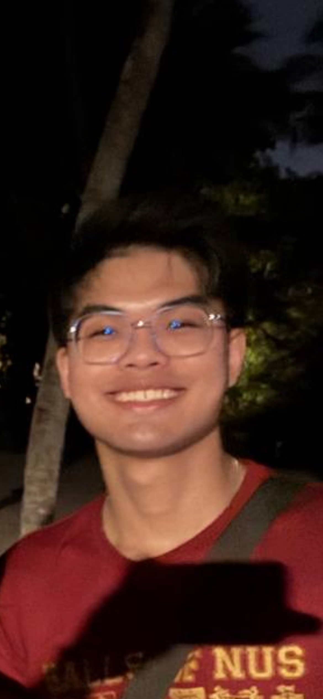
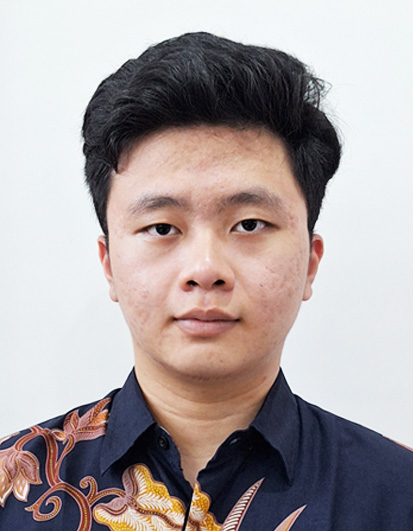
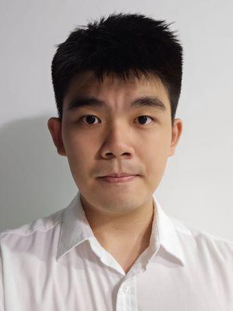
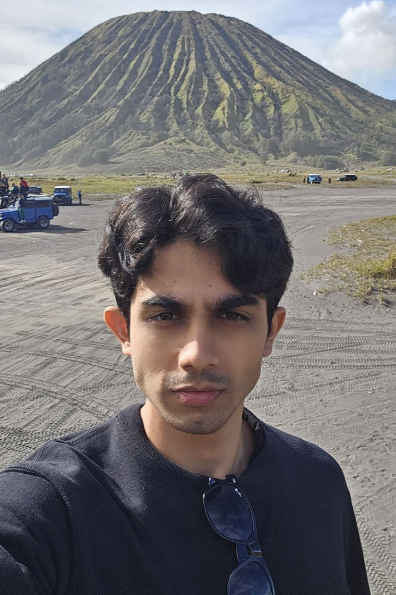

We are a team based in the [School of Computing, National University of Singapore](https://www.comp.nus.edu.sg).

You can reach us at the email `seer[at]comp.nus.edu.sg`

## Project team

### Samuel Chua

[[github](https://github.com/leumu)]
[[portfolio](team/johndoe.md)]

* Role: Developer
* Responsibilities: UI

### Gary Axel Muliyono

[[github](http://github.com/salmonkarp)]
[[portfolio](team/salmonkarp.md)]

* Role: Developer
* Responsibilities: Scheduling and Tracking

### Leifsen Law

[[github](http://github.com/BarneyLaw)] [[portfolio](team/johndoe.md)]

* Role: Developer
* Responsibilities: Documentation

### Ronith Saju

[[github](https://github.com/ronithsaju)]
[[portfolio](team/johndoe.md)]

* Role: Developer
* Responsibilities: Code quality

### Marcus Leong

[[github](http://github.com/marcusleonghk)]
[[portfolio](team/johndoe.md)]

* Role: Developer
* Responsibilities: Deliverables and deadlines
