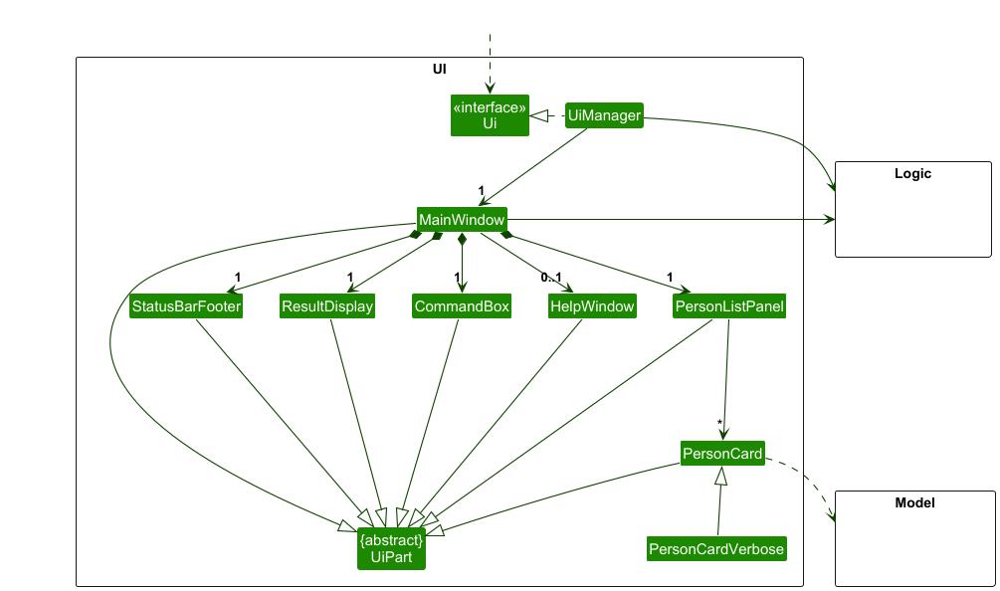
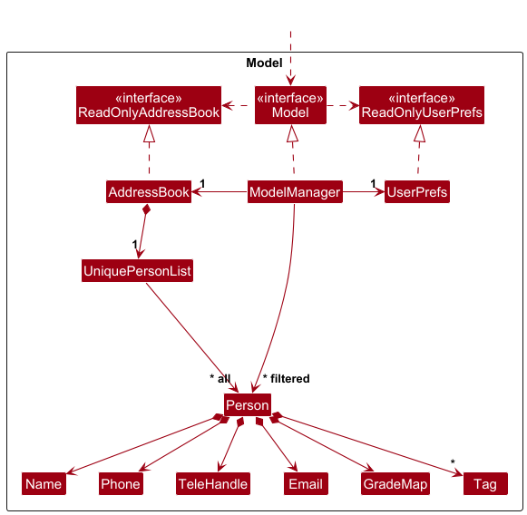
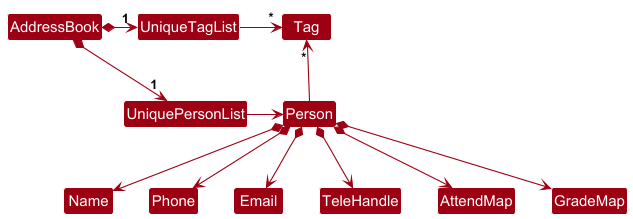

* Table of Contents
{:toc}

--------------------------------------------------------------------------------------------------------------------

## **Acknowledgements**

* {list here sources of all reused/adapted ideas, code, documentation, and third-party libraries -- include links to the original source as well}

--------------------------------------------------------------------------------------------------------------------

## **Setting up, getting started**

Refer to the guide [_Setting up and getting started_](SettingUp.md).

--------------------------------------------------------------------------------------------------------------------

## **Design**

:bulb: **Tip:** The `.puml` files used to create diagrams are in this document `docs/diagrams` folder. Refer to the [_PlantUML Tutorial_ at se-edu/guides](https://se-education.org/guides/tutorials/plantUml.html) to learn how to create and edit diagrams.

### Architecture

The ***Architecture Diagram*** given above explains the high-level design of the App.

Given below is a quick overview of main components and how they interact with each other.

**Main components of the architecture**

**`Main`** (consisting of classes [`Main`](https://github.com/se-edu/addressbook-level3/tree/master/src/main/java/seedu/address/Main.java) and [`MainApp`](https://github.com/se-edu/addressbook-level3/tree/master/src/main/java/seedu/address/MainApp.java)) is in charge of the app launch and shut down.
* At app launch, it initializes the other components in the correct sequence, and connects them up with each other.
* At shut down, it shuts down the other components and invokes cleanup methods where necessary.

The bulk of the app's work is done by the following four components:

* [**`UI`**](#ui-component): The UI of the App.
* [**`Logic`**](#logic-component): The command executor.
* [**`Model`**](#model-component): Holds the data of the App in memory.
* [**`Storage`**](#storage-component): Reads data from, and writes data to, the hard disk.

[**`Commons`**](#common-classes) represents a collection of classes used by multiple other components.

**How the architecture components interact with each other**

The *Sequence Diagram* below shows how the components interact with each other for the scenario where the user issues the command `delete 1`.

Each of the four main components (also shown in the diagram above),

* defines its *API* in an `interface` with the same name as the Component.
* implements its functionality using a concrete `{Component Name}Manager` class (which follows the corresponding API `interface` mentioned in the previous point.

For example, the `Logic` component defines its API in the `Logic.java` interface and implements its functionality using the `LogicManager.java` class which follows the `Logic` interface. Other components interact with a given component through its interface rather than the concrete class (reason: to prevent outside component's being coupled to the implementation of a component), as illustrated in the (partial) class diagram below.

The sections below give more details of each component.

### UI component

The **API** of this component is specified in [`Ui.java`](https://github.com/se-edu/addressbook-level3/tree/master/src/main/java/seedu/address/ui/Ui.java)

The UI consists of a `MainWindow` that is made up of parts e.g.`CommandBox`, `ResultDisplay`, `PersonListPanel`, `StatusBarFooter` etc. All these, including the `MainWindow`, inherit from the abstract `UiPart` class which captures the commonalities between classes that represent parts of the visible GUI.

The `UI` component uses the JavaFx UI framework. The layout of these UI parts are defined in matching `.fxml` files that are in the `src/main/resources/view` folder. For example, the layout of the [`MainWindow`](https://github.com/se-edu/addressbook-level3/tree/master/src/main/java/seedu/address/ui/MainWindow.java) is specified in [`MainWindow.fxml`](https://github.com/se-edu/addressbook-level3/tree/master/src/main/resources/view/MainWindow.fxml)

The `UI` component,

* executes user commands using the `Logic` component.
* listens for changes to `Model` data so that the UI can be updated with the modified data.
* keeps a reference to the `Logic` component, because the `UI` relies on the `Logic` to execute commands.
* depends on some classes in the `Model` component, as it displays `Person` object residing in the `Model`.

### Logic component

**API** : [`Logic.java`](https://github.com/se-edu/addressbook-level3/tree/master/src/main/java/seedu/address/logic/Logic.java)

Here's a (partial) class diagram of the `Logic` component:

The sequence diagram below illustrates the interactions within the `Logic` component, taking `execute("delete 1")` API call as an example.

:information_source: **Note:** The lifeline for `DeleteCommandParser` should end at the destroy marker (X) but due to a limitation of PlantUML, the lifeline continues till the end of diagram.

How the `Logic` component works:

1. When `Logic` is called upon to execute a command, it is passed to an `AddressBookParser` object which in turn creates a parser that matches the command (e.g., `DeleteCommandParser`) and uses it to parse the command.
1. This results in a `Command` object (more precisely, an object of one of its subclasses e.g., `DeleteCommand`) which is executed by the `LogicManager`.
1. The command can communicate with the `Model` when it is executed (e.g. to delete a person). 
   Note that although this is shown as a single step in the diagram above (for simplicity), in the code it can take several interactions (between the command object and the `Model`) to achieve.
1. The result of the command execution is encapsulated as a `CommandResult` object which is returned back from `Logic`.

Here are the other classes in `Logic` (omitted from the class diagram above) that are used for parsing a user command:

How the parsing works:
* When called upon to parse a user command, the `AddressBookParser` class creates an `XYZCommandParser` (`XYZ` is a placeholder for the specific command name e.g., `AddCommandParser`) which uses the other classes shown above to parse the user command and create a `XYZCommand` object (e.g., `AddCommand`) which the `AddressBookParser` returns back as a `Command` object.
* All `XYZCommandParser` classes (e.g., `AddCommandParser`, `DeleteCommandParser`, ...) inherit from the `Parser` interface so that they can be treated similarly where possible e.g, during testing.

### Model component
**API** : [`Model.java`](https://github.com/se-edu/addressbook-level3/tree/master/src/main/java/seedu/address/model/Model.java)

The `Model` component,

* stores the address book data i.e., all `Person` objects (which are contained in a `UniquePersonList` object).
* stores the currently 'selected' `Person` objects (e.g., results of a search query) as a separate _filtered_ list which is exposed to outsiders as an unmodifiable `ObservableList<Person>` that can be 'observed' e.g. the UI can be bound to this list so that the UI automatically updates when the data in the list change.
* stores a `UserPref` object that represents the user’s preferences. This is exposed to the outside as a `ReadOnlyUserPref` objects.
* does not depend on any of the other three components (as the `Model` represents data entities of the domain, they should make sense on their own without depending on other components)

:information_source: **Note:** An alternative (arguably, a more OOP) model is given below. It has a `Tag` list in the `AddressBook`, which `Person` references. This allows `AddressBook` to only require one `Tag` object per unique tag, instead of each `Person` needing their own `Tag` objects. 

### Storage component

**API** : [`Storage.java`](https://github.com/se-edu/addressbook-level3/tree/master/src/main/java/seedu/address/storage/Storage.java)

The `Storage` component,
* can save both address book data and user preference data in JSON format, and read them back into corresponding objects.
* inherits from both `AddressBookStorage` and `UserPrefStorage`, which means it can be treated as either one (if only the functionality of only one is needed).
* depends on some classes in the `Model` component (because the `Storage` component's job is to save/retrieve objects that belong to the `Model`)

### Common classes

Classes used by multiple components are in the `seedu.address.commons` package.

--------------------------------------------------------------------------------------------------------------------

## **Implementation**

This section describes some noteworthy details on how certain features are implemented.

### Fuzzy Matching ###
The fuzzy command matching feature is designed to improve the user experience by automatically correcting minor typos in command words.
This prevents users from having to re-type a command due to a small mistake.
The implementation is primarily located in the AddressBookParser class.

1. When a user enters a command, the parseCommand(String userInput) method is invoked. It extracts the command word from the input.
2. This command word is then passed to the private helper method fuzzyMatch(String commandWord).

The sequence diagram below illustrates the interactions within the `Logic` component, taking `execute("addd ...")` API call as an example.

3. The fuzzyMatch method leverages the LevenshteinDistance class from the org.apache.commons.text.similarity library. 
   This algorithm measures the number of single-character edits (insertions, deletions, or substitutions) required to change one word into another.
4. A MAX_DIST_THRESHOLD is set to 1, meaning only commands with a Levenshtein distance of 1 from a valid command will be corrected.
5. The method first checks for a direct, case-sensitive match against a predefined list of COMMAND_KEYWORDS.
6. If no exact match is found, it calculates the Levenshtein distance between the user's input and each known command keyword. 
   If it finds a keyword within the distance threshold, that keyword is returned.
7. If no command keyword is found within the threshold, a ParseException is thrown, indicating an unknown command. Moreover, if two command words are of a similar Levenshtein Distance, an Exception is thrown due to the ambiguous command.
8. The corrected command word is then used to select the appropriate parser (e.g., AddCommandParser) to handle the command's arguments.

#### Examples of fuzzy matched commands ####
`Fuzzy Matched Command` -> `Executed Command`
1. `addd` -> `add`
2. `delet` -> `delete`
3. `liss` -> `list`
4. `uattend` / `nattend` -> `Exception Thrown (Ambiguous Command)`

--------------------------------------------------------------------------------------------------------------------

## **Documentation, logging, testing, configuration, dev-ops**

* [Documentation guide](Documentation.md)
* [Testing guide](Testing.md)
* [Logging guide](Logging.md)
* [Configuration guide](Configuration.md)
* [DevOps guide](DevOps.md)

--------------------------------------------------------------------------------------------------------------------

## **Appendix: Requirements**

### Product scope

**Target user profile**:

* MA1521 tutors/lecturers
* has a need to manage a significant number of student contacts
* prefer desktop apps over other types
* can type fast
* prefers typing to mouse interactions
* is reasonably comfortable using CLI apps

**Value proposition**: Provides Teaching Assistants with a streamlined, CLI-based management tool that gives them quick and organized access to their assigned students, including profile details, and performance records. TAs can record marks, manage assignments and track attendance without leaving the CLI environment, thus saving time and reducing friction.

### User stories

Priorities: High (must have) - `* * *`, Medium (nice to have) - `* *`, Low (unlikely to have) - `*`

| Priority | As a …                                     | I want to …                                                                       | So that I can …                                                                          |
|----------|--------------------------------------------|-----------------------------------------------------------------------------------|------------------------------------------------------------------------------------------|
| `* * *`  | MA1521 TA using the app for the first time | view the list of available basic commands and their general purpose               | start exploring the app's functionalities                                                |
| `* * *`  | MA1521 TA                                  | assign student grades for assignments and exams                                   | keep track of the student grades                                                         |
| `* * *`  | MA1521 TA                                  | view each student's specific credentials                                          | verify their identity and manage group assignments                                       |
| `* * *`  | MA1521 TA                                  | create student profiles                                                           | add students to my tutorial                                                              |
| `* * *`  | MA1521 TA                                  | delete student profiles                                                           | remove students from my tutorial                                                         |
| `* *`    | MA1521 TA                                  | find a specific student's contact details from their name only                    | save time instead of searching students in my tutorial group one-by-one                  |
| `* *`    | MA1521 TA                                  | mark the attendance of multiple students                                          | calculate the students attendance score                                                  |
| `* *`    | MA1521 TA                                  | unmark the attendance of a student                                                | fix the attendance in the event where I keyed in wrongly                                 |
| `* *`    | MA1521 TA                                  | view the students I have in each of the multiple classes I conduct                | find out who are in each of my tutorial groups                                           |
| `* *`    | MA1521 TA                                  | view a single students performance across assignments and attendance              | track their progress over time                                                           |
| `* *`    | MA1521 TA using the app for the first time | tag students to their tutorial groups                                             | differentiate between my different tutorial groups                                       |
| `* *`    | MA1521 TA using the app for the first time | have the system recognize my command despite a small typo                         | efficiently execute commands despite having small typos                                  |
| `* *`    | MA1521 TA                                  | update student profile                                                            | edit the records of my students                                                          |
| `* *`    | MA1521 TA using the app for the first time | see how I use a specific command (arguments, format, etc.)                        | use a command properly                                                                   |
| `* *`    | MA1521 TA                                  | view a summary of grades for an assignment                                        | find out the overall performance of my class                                             |
| `* *`    | MA1521 TA                                  | sort the list of students I have based on alphabetical order                      | obtain specific orderings for admin tasks                                                |
| `* *`    | MA1521 TA                                  | sort the list of students I have based on overall marks                           | identify a general grade trend as well as students I need to assist more during teaching |
| `*`      | MA1521 TA                                  | get all my students' emails/phone numbers to my clipboard in one command          | instantly paste said details into another application (e.g. email)                       |
| `*`      | CLI Experienced MA1521 TA                  | import previous student data (csv, etc.) into this new application                | seamlessly continue my workflow without excessive data reformatting                      |
| `*`      | Intermediate MA1521 TA user                | add pictures / notes about my students                                            | remember them better and add remarks about them                                          |
| `*`      | Aesthetically oriented MA1521 TA           | change colour theme                                                               | customize the appearance                                                                 |
| `*`      | Impatient MA1521 TA                        | command responses to appear within 1 second                                       | work quickly and efficiently                                                             |
| `*`      | MA1521 TA using the app for the first time | allow the long commands to be broken into multiple parts                          | be more familiarized with the commands                                                   |
| `*`      | MA1521 TA using the app for the first time | see if my command is wrong without clearing out the command if i typed it wrongly | edit my command instead of retyping it                                                   |

### Use cases

For all use cases below, the System is **CalcConnect** and the Actor is **MA1521 TA**.

<table>
  <tr>
    <td>

**Use case: UC01 - Get Help**

**MSS:**
1.  TA requests a list of all commands.
2.  CalcConnect displays all keywords and commands able to be used.

    Use case ends.

    </td>
  </tr>
  <tr>
    <td>

**Use case: UC02 - Show all Students**

**MSS:**
1.  TA requests see all students in the address book.
2.  CalcConnect changes the display (if needed) to show all students in the address book.

    Use case ends.

    </td>
  </tr>
  <tr>
    <td>

**Use case: UC03 - Add Student**

**MSS:**
1.  TA requests to add a student.
2.  CalcConnect adds the student.
3.  CalcConnect displays the updated address book.

    Use case ends.

**Extensions:**
* 1a. Any of the written fields is invalid or missing.
    * 1a1. CalcConnect shows a specific error message and the correct format.

      Use case resumes at step 1.

* 1b. The student already exists in the address book.
    * 1b1. CalcConnect shows an appropriate error message.
  
      Use case ends.

    </td>
  </tr>
  <tr>
    <td>

**Use case: UC04 - Edit Student Credentials**

**Preconditions:** Address book has at least 1 student.

**MSS:**
1.  TA requests to edit a student’s credentials.
2.  CalcConnect updates the student’s credentials.
3.  CalcConnect displays the updated address book.

    Use case ends.

**Extensions:**
* 1a. The given student index is invalid.
    * 1a1. CalcConnect shows an appropriate error message.
  
      Use case resumes at step 1.

* 1b. Any of the written fields is invalid or missing.
    * 1b1. CalcConnect shows a specific error message and the correct format.
  
      Use case resumes at step 1.

    </td>
  </tr>
  <tr>
    <td>

**Use case: UC05 - Delete Student**

**Preconditions:** Address book has at least 1 student.

**MSS:**
1.  TA requests to delete a student in the address book.
2.  CalcConnect deletes the student.
3.  CalcConnect displays the updated address book.

    Use case ends.

**Extensions:**
* 1a. The given student index is invalid.
    * 1a1. CalcConnect shows an appropriate error message.

      Use case resumes at step 1.

    </td>
  </tr>
  <tr>
    <td>

**Use case: UC06 - Exit Application**

**MSS:**
1.  TA requests to exit the application.
2.  CalcConnect stops execution and closes.

    Use case ends.

    </td>
  </tr>
  <tr>
    <td>

**Use case: UC07 - Clear all Students**

**MSS:**
1.  TA requests to clear all students in the address book.
2.  CalcConnect clears all students in the address book.
3.  CalcConnect displays the updated address book.

    Use case ends.

    </td>
  </tr>
  <tr>
    <td>

**Use case: UC08 - Assign Grade to Student**

**Preconditions:** Address book has at least 1 student.

**MSS:**
1.  TA requests to assign a grade for an assignment to a student.
2.  CalcConnect assigns the grade for the assignment to the student.

    Use case ends.

**Extensions:**
* 1a. The given student index is invalid or the address book is empty.
    * 1a1. CalcConnect shows an appropriate error message.

      Use case ends.

* 1b. Any of the written fields is invalid or missing.
    * 1b1. CalcConnect shows a specific error message.

      Use case resumes at step 1.

* 1c. There is already an existing grade assigned for the assignment for the student.
    * 1c1. CalcConnect replaces the existing grade with the new grade provided.

      Use case ends.

* 1d. The grade field is left empty.
    * 1d1. If there is already an existing grade assigned for the assignment to the student, CalcConnect removes the existing grade. Else, CalcConnect does nothing.

      Use case ends.

    </td>
  </tr>
  <tr>
    <td>

**Use case: UC09 - Find Student(s)**

**MSS:**
1.  TA requests to find student(s) using keyword(s).
2.  CalcConnect lists out all the students with matching keyword(s).

    Use case ends.

**Extensions:**
* 1a. No matching student(s) found.
    * 1a1. CalcConnect shows that no student has been found.

      Use case ends.

* 1b. Any of the written fields is invalid or missing.
    * 1b1. CalcConnect shows a specific error message and the correct format.

      Use case ends.

    </td>
  </tr>
  <tr>
    <td>

**Use case: UC10 - View all students in a Tutorial Group**

**MSS:**
1.  TA requests to <ins>find students (UC09)</ins> of a particular tutorial group.
2.  CalcConnect lists out all the students in the tutorial group.

    Use case ends.

**Extensions:**
* 1a. The tutorial group name given is in the wrong format.
    * 1a1. CalcConnect shows an appropriate error message.

      Use case resumes at step 1.

* 1b. The tutorial group does not exist or has no students.
    * 1b1. CalcConnect shows that no student has been found.

      Use case ends.

    </td>
  </tr>
  <tr>
    <td>

**Use case: UC11 - Mark Attendance**

**Preconditions:** Address book has at least 1 student.

**MSS:**
1.  TA <ins>views all students in a tutorial group (UC10)</ins>.
2.  TA marks attendance of the student(s) present for the specific tutorial class.
3.  CalcConnect sets the student(s) as attended for the specific tutorial class.

    Use case ends.

**Extensions:**
* 2a. The tutorial group has no students.
    * 2a1. CalcConnect shows an appropriate error message.

      Use case resumes at step 1.

* 2b. The given student index(es) is/are invalid.
    * 2b1. CalcConnect shows an appropriate error message.

      Use case resumes at step 2.

* 2c. The tutorial class field written is invalid or missing.
    * 2c1. CalcConnect shows a specific error message and the correct format.

      Use case resumes at step 2.

    </td>
  </tr>
  <tr>
    <td>

**Use case: UC12 - Unmark Attendance**

**Preconditions:** Address book has at least 1 student.

**MSS:**
1.  TA <ins>views all students in a tutorial group (UC10)</ins>.
2.  TA unmarks attendance of the student for the specific tutorial class.
3.  CalcConnect sets the student as not attended for the specific tutorial class.

    Use case ends.

**Extensions:**
* 2a. The tutorial group has no students.
    * 2a1. CalcConnect shows an appropriate error message.

      Use case resumes at step 1.

* 2b. The given student index is invalid.
    * 2b1. CalcConnect shows an appropriate error message.

      Use case resumes at step 2.

* 2c. The tutorial class field written is invalid or missing.
    * 2c1. CalcConnect shows a specific error message and the correct format.

      Use case resumes at step 2.

* 2d. The student is currently already set as not attended for the specific tutorial class.
    * 2d1. CalcConnect does nothing.

      Use case ends.

    </td>
  </tr>
  <tr>
    <td>

**Use case: UC13 - Sort Students**

**MSS:**
1.  TA requests to sort the students by a specific field in ascending/descending order.
2.  CalcConnect sorts the students by the field and order.

    Use case ends.

**Extensions:**
* 1a. The written field or order invalid.
    * 1a1. CalcConnect shows a specific error message and the correct format.

      Use case ends.

    </td>
  </tr>
</table>

### Non-Functional Requirements

1.  The software should work on any _mainstream OS_ platforms (Constraint-Platform-Independent). 
2.  The software should work on a computer that has version `17` of Java (Constraint-Java-Version). 
3.  The software should work without requiring an installer (Constraint-Portable). 
4.  The software should not depend on your own remote server (Constraint-No-Remote-Server). 
5.  The GUI should be usable (i.e., all functions can be used even if the user experience is not optimal) for, 1. resolutions 1280x720 and higher, and, 2. for screen scales 150% (Constraint-Screen-Resolution).
6.  The software should be able to be packaged into a single JAR file (Constraint-Single-File).
7.  The data should be stored locally and should be in a human editable text file (Constraint-Human-Editable-File).
8.  The file size of the product should not exceed 100MB (Constraint-File-Size).
9.  Should be able to hold up to 1000 persons without a noticeable sluggishness in performance for typical usage. 
10. A user with above average typing speed for regular English text (i.e. not code, not system admin commands) should be able to accomplish most of the tasks faster using commands than using the mouse.
11. The system should respond within two seconds for common operations such as querying, finding or sorting a large number of students (potentially hundreds). 
12. The system should be usable by a novice who has never been a Teaching Assistant before.

### Glossary

* **Mainstream OS**: Windows, Linux, Unix, MacOS
* **MA1521**: Calculus for Computing course, containing typically hundreds of Y1 NUS students
* **TA / Tutor**: A teaching assistant who conducts tutorials for MA1521
* **Professor**: A professor who teaches MA1521, and oversees the tutors and the course management
* **Student**: A student who is enrolled in MA1521, and attends tutorials conducted by tutors
* **Assignment**: A piece of coursework that students need to submit for grading
* **Attendance**: The state of being present in a certain tutorial session
* **Student Credentials**: A student’s name, NUS student number, email address, tutorial group number, etc.

--------------------------------------------------------------------------------------------------------------------

## **Appendix: Instructions for manual testing**

Given below are instructions to test the app manually.

:information_source: **Note:** These instructions only provide a starting point for testers to work on;
testers are expected to do more *exploratory* testing.

### Launch and shutdown

1. Initial launch

   1. Download the jar file and copy into an empty folder

   1. Double-click the jar file Expected: Shows the GUI with a set of sample contacts. The window size may not be optimum.

1. Saving window preferences

   1. Resize the window to an optimum size. Move the window to a different location. Close the window.

   1. Re-launch the app by double-clicking the jar file. 
       Expected: The most recent window size and location is retained.

1. _{ more test cases …​ }_

### Adding a person
1. Adding a person while all persons are being shown
    1. Prerequisites: NIL
        
    1. Test case: `add n/John Doe p/98765432 e/johnd@example.com u/@john tg/tg1`
       Expected: John Doe is added to the bottom of the list. Details of the added contact shown in the status message. Command is reflected in the Command History.

2. Adding a person but missing a compulsory field
   1. Prerequisites: NIL
   1. Test case: `add n/John Doe p/98765432 e/john@example.com tg/tg1`
   Expected: Error message explaining the missing field(s) and showing the proper command format.

3. Adding a person who already exists (same email) in the AddressBook
    1. Prerequisites: NIL
   1. Test case (lowercase): `add n/David Li p/98765432 e/charlotte@example.com u/@dave tg/10`
    Expected: Error message: "This person already exists in the address book."

   2. Test case (uppercase): `add n/David Li p/98765432 e/CHARLOTTE@EXAMPLE.COM u/@dave tg/10`
      Expected: Error message: "This person already exists in the address book."

4. Adding a person with an invalid field
    1. Prerequisites: NIL
    1. Test case: `add n/John Doe p/872hvcfh e/john@example.com u/@john tg/tg01`
    Expected: Phone numbers should only contain numbers, and it should be at least 3 digits long

5. Adding a person with a duplicate prefix
   1. Prerequisites: NIL
   1. Test case: `add n/John Doe p/98765432 e/johnd@example.com u/@john u/@johnny tg/tg1`
          Expected: The prefixes which are duplicated will be shown. "The following prefix(es) can only be used once: u/"

### Editing a person
1. Editing a person while all persons are being shown
    1. Prerequisites: At least one person is being shown in the list
    1. Test case: `edit 1 p/91234567`
       Expected: The `Phone Number` of the first person is updated. A success message is displayed.
    2. Test case: `edit 1 p/91234567 u/@rachel`
       Expected: The `Phone Number` and `Telegram Handle` of the first person is updated. A success message is displayed.

2. Editing a person to create a duplicate (same email)
    1. Prerequisites: Person who is being duplicated is in the list
    1. Test case: `edit 3 e/charlotte@example.com`
       Expected: Error message: "This person already exists in the address book."

3. Editing a person with an invalid index
    1. Prerequisites: NIL
    1. Test case: `edit 0 p/91234567`
       Expected: Error message: "This person already exists in the address book."

4. Editing a person with an invalid field value
    1. Prerequisites: Person being edited exists in the list
    1. Test case: `edit 1 u/InvalidHandle`
       Expected: Error message explaining the field constraint violation.

5. Editing a person with a duplicate prefix
    1. Prerequisites: Person being edited exists in the list
    1. Test case: `edit 1 p/91234567 p/98765432`
       Expected: The prefixes which are duplicated will be shown. "The following prefix(es) can only be used once: p/"

### Grading a student
1. Grading a student while all persons are being shown

    1. Prerequisites: List all students using the `list` command. Multiple students in the list.

    1. Test case: `grade 1 a/Q1 g/100` 
       Expected: First student's Q1 grade is set to 100. Details of the graded contact shown in the status message.

    1. Test case: `grade [LAST_STUDENT_INDEX] a/fInAls g/0.0000` 
       Expected: Last student's Finals grade is set to 0. Details of the graded contact shown in the status message.

    1. Test case: `grade 3 a/InvalidGrade g/85.5` 
       Expected: No student is graded. Error details shown in the status message.

    1. Other incorrect grade commands to try: `grade`, `grade x a/Q1 g/100`, `grade 1 a/Q1 g/110`, `grade 1 a/Q5 g/-50` 
       Expected: Error details shown in the status message.

1. Grading a student after a find command

    1. Prerequisites: Find a subset of students using the `find` command. Multiple students in the filtered list.

    1. Test case: `grade 1 a/Q2 g/100` 
       Expected: First student's Q2 grade in the filtered list is set to 75. Details of the graded contact shown in the status message.

    1. Test case: `grade [LAST_FILTERED_STUDENT_INDEX] a/fInAlS g/0.0000` 
       Expected: Last student's Finals grade in the filtered list is set to 88. Details of the graded contact shown in the status message.

    1. Test case: `grade 2 a/InvalidAssignment g/60` 
       Expected: No student is graded. Error details shown in the status message.

    1. Other incorrect grade commands to try: `grade`, `grade InvalidIndex a/Q2 g/75`, `grade 1 a/Q2 g/150`, `grade 1 a/Finals g/-10` 
       Expected: Error details shown in the status message.

1. Grading a student when list is empty

    1. Prerequisites: Delete all students using the `clear` command.

    1. Test case: `grade 1 n/Q1 g/100` 
       Expected: No student is graded. Error details shown in the status message.

### Marking a student's tutorial class attendance
1. Marking a student's tutorial class attendance while all students are being shown

   Prerequisites: List all students using the `list` command. Multiple students in the list.

    1. Test case: `attend 1 c/t1` 
       Expected: First student's t1 attendance is set to 1. Details of the attended contact shown in the status message.

    2. Test case: `attend 1 2 3 c/t1` 
       Expected: First, second and third student's t1 attendance is set to 1. Details of the attended contact shown in the status message.

    3. Test case: `attend [LAST_STUDENT_INDEX] c/t2` 
       Expected: Last student's t2 attendance is set to 1. Details of the attended contact shown in the status message.

    4. Test case: `attend 2 c/InvalidTutorialClass` 
       Expected: No student's attendance is marked. Error details shown in the status message.

    5. Other incorrect attend commands to try: `attend`, `attend InvalidIndex c/t1`, `attend 1 InvalidIndex c/t1` 
       Expected: Error details shown in the status message.

1. Marking a student's tutorial class attendance after a find command

   Prerequisites: Find a subset of students using the `find` command. Multiple students in the filtered list.

    1. Test case: `attend 1 c/t1` 
       Expected: First student's t1 attendance is set to 1. Details of the attended contact shown in the status message.

    2. Test case: `attend 2 c/InvalidTutorialClass` 
        Expected: No student's attendance is marked. Error details shown in the status message.

1. Marking a student's tutorial class when list is empty

    1. Prerequisites: Delete all students using the `clear` command.

    2. Test case: `attend 1 c/t3` 
       Expected: No student's attendance is marked. Error details shown in the status message.

### Unmarking a student's tutorial class attendance
1. Unmarking a student's tutorial class attendance while all students are being shown

   Prerequisites: List all students using the `list` command. Multiple students in the list.

    1. Test case: `unattend 1 c/t1` 
       Expected: First student's t1 attendance is set to 0. Details of the unattended contact shown in the status message.

    2. Test case: `unattend [LAST_STUDENT_INDEX] c/t2` 
       Expected: Last student's t2 attendance is set to 0. Details of the unattended contact shown in the status message.

    3. Test case: `unattend 2 c/InvalidTutorialClass` 
       Expected: No student's attendance is unmarked. Error details shown in the status message.

    4. Other incorrect unattend commands to try: `unattend`, `unattend InvalidIndex c/t1`, `unattend 1 c/t1 c/t2` 
       Expected: Error details shown in the status message.

2. Unmarking a student's tutorial class attendance after a find command

   Prerequisites: Find a subset of students using the `find` command. Multiple students in the filtered list.

    1. Test case: `unattend 1 c/t1` 
       Expected: First student's t1 attendance is set to 0. Details of the unattended contact shown in the status message.

    2. Test case: `unattend 2 c/InvalidTutorialClass` 
       Expected: No student's attendance is unmarked. Error details shown in the status message.

3. Unmarking a student's tutorial class when list is empty

    1. Prerequisites: Delete all students using the `clear` command.

    2. Test case: `unattend 1 c/t3` 
       Expected: No student's attendance is unmarked. Error details shown in the status message.

### Deleting a person

1. Deleting a person while all persons are being shown

   1. Prerequisites: List all persons using the `list` command. Multiple persons in the list.

   1. Test case: `delete 1` 
      Expected: First contact is deleted from the list. Details of the deleted contact shown in the status message. Timestamp in the status bar is updated.

   1. Test case: `delete 0` 
      Expected: No person is deleted. Error details shown in the status message. Status bar remains the same.

   1. Other incorrect delete commands to try: `delete`, `delete x`, `...` (where x is larger than the list size) 
      Expected: Similar to previous.

1. _{ more test cases …​ }_

### Saving data

1. Dealing with missing/corrupted data files

   1. _{explain how to simulate a missing/corrupted file, and the expected behavior}_

1. _{ more test cases …​ }_

## **Appendix: Effort**

The total effort spent on active development so far is approximately `>=125` hours.
This includes time spent on design, implementation, testing, documentation, and project management activities.

A small part of the implementation of the Fuzzy Search feature was done through an external library.
[This library](https://commons.apache.org/proper/commons-text/apidocs/org/apache/commons/text/similarity/LevenshteinDistance.html) is from the Apache Commons project and is licensed under the [Apache License 2.0](https://www.apache.org/licenses/LICENSE-2.0).

### Difficulty level
The difficulty level of this project is considered to be 'Moderate', tending to occasionally 'High' at the earlier stages of development.

This was due to the need to modify the original commands' implementations significantly to fit the new requirements,
which often had a compound effect on other parts of the codebase, and thus was also difficult to segment amongst members.

Furthermore, multiple new object types have been created to represent new complex attributes.
Given that these attributes (Attendance, Grades) are often non-trivial, they required extensive code and tests to ensure their correctness and robustness.

### Challenges faced
Some of the challenges faced during the development of this project include:
* Initial learning process of the codebase, which was very interconnected prior to making any significant changes.
* Selecting design choices that would best fit the new requirements while minimizing the impact on existing functionalities and making future extensions easier.
* Segmenting work effectively among team members, given the interconnected nature of the codebase.

### Achievements
Some of the general achievements of this project include:
* Successful implementation of all core MVP requirements.
* Implementation of additional features such as Fuzzy Search.
* Aesthetic improvements to the UI to utilize more screen space and enhance user experience.
* Enhanced CLI experience through addition of a navigable command history.
