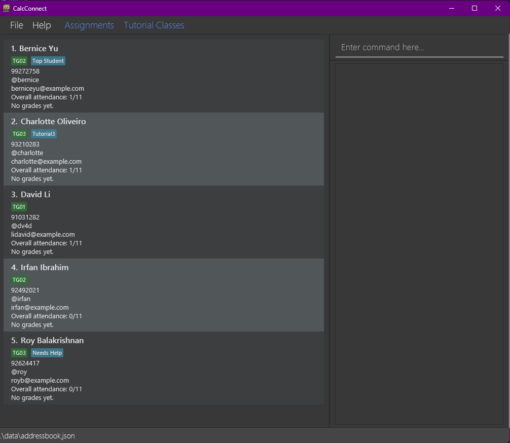
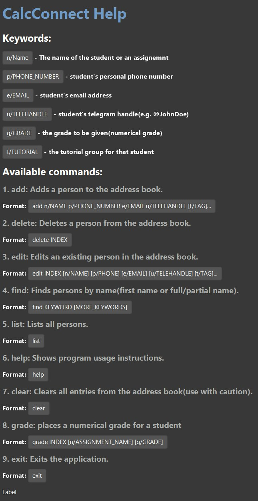
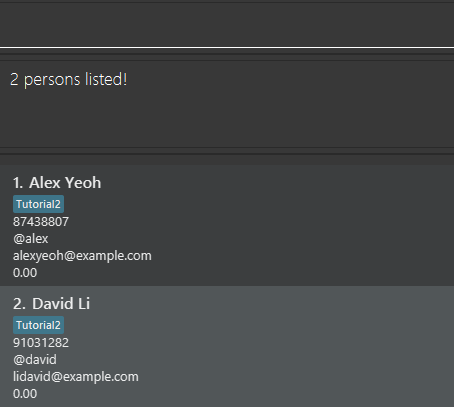

CalcConnect allows you to **manage your students’ information on your desktop with keyboard commands**. If you type fast, you can complete your student management tasks faster with CalcConnect than with mouse-based apps. CalcConnect aims to be your **all-in-one tool** to manage the administrative processes of your students. From easily being able to find their contact information to marking their attendance and grading their assignments. Once you familiarise yourself with our intuitive interface, CalcConnect will provide **unparalleled ease** in managing your students.

CalcConnect is designed for **MA1521 TAs** who are technologically inclined. While those familiar with Command Line Interface (CLI) from their previous experience in Computing courses might find it easier to use it, we also have this clear user guide to help those without such previous experience.

--------------------------------------------------------------------------------------------------------------------

* Table of Contents
{:toc}

--------------------------------------------------------------------------------------------------------------------

## Quick start

1. **Windows** and **Linux** users: Ensure you have Java `17` or above installed in your Computer. 
   **Mac users:** Ensure you have the precise JDK version prescribed [here](https://se-education.org/guides/tutorials/javaInstallationMac.html).

1. Download the latest `.jar` file from [here](https://github.com/AY2526S1-CS2103T-F08B-4/tp/releases).

1. Copy the file to the folder you want to use as the **home folder** for your AddressBook.

1. Go into the folder you put the jar file in, right-click anywhere in the folder space and select **Open in Terminal** (Windows).
   

2. For Mac and Linux users, open the Terminal app and use the `cd` command to change the current directory to the folder you put the jar file in.

2. Use the `java -jar CalcConnect.jar` command to run the application. 
   A GUI similar to the below should appear in a few seconds. Note how the app contains some sample data. 
   

1. Type the command in the command box and press **Enter** to execute it. e.g. typing **`help`** and pressing Enter will open the help window. 
   Some example commands you can try:

   * `list` : Lists all contacts.

   * `add n/John Doe p/98765432 e/johnd@example.com u/@john tg/TG01 t/Smart` : Adds a contact named `John Doe` to the Address Book.

   * `delete 3` : Deletes the 3rd contact shown in the current list.

   * `clear` : Deletes all contacts.

   * `exit` : Exits the app.

1. Refer to the [Features](#features) below for details of each command.

--------------------------------------------------------------------------------------------------------------------

## Features

**:information_source: Notes about the command format:** 

* Words in `UPPER_CASE` are the parameters to be supplied by the user. 
  e.g. in `add n/NAME`, `NAME` is a parameter which can be used as `add n/John Doe`.

* Items in square brackets are optional. 
  e.g `n/NAME [t/TAG]` can be used as `n/John Doe t/Good Student` or as `n/John Doe`.

* Items with `…`​ after them can be used multiple times including zero times. 
  e.g. `[t/TAG]…​` can be used as ` ` (i.e. 0 times), `t/Good Student`, `t/Good Student t/Smart` etc.

* Parameters can be in any order. 
  e.g. if the command specifies `n/NAME p/PHONE_NUMBER`, `p/PHONE_NUMBER n/NAME` is also acceptable.

* Extraneous parameters for commands that do not take in parameters (such as `help`, `list`, `exit` and `clear`) will be ignored. 
  e.g. if the command specifies `help 123`, it will be interpreted as `help`.

* If you are using a PDF version of this document, be careful when copying and pasting commands that span multiple lines as space characters surrounding line-breaks may be omitted when copied over to the application.

### Fuzzy Command Matching

The app includes a fuzzy matching feature for commands to enhance user experience. If you make a small typo when entering a command, the application will attempt to match it to the most similar valid command.

This feature uses the Levenshtein distance algorithm with a maximum allowed distance of **1**. This means that commands with a single character difference (insertion, deletion or substitution) from a valid command will be automatically corrected and executed.

Examples:
*   If you type `addd`, it will be interpreted as `add`.
*   If you type `liss`, it will be interpreted as `list`.
*   If you type `eddit`, it will be interpreted as `edit`.
*   If you type `ad`, it will be interpreted as `add`.

However, if the typo is too different from any valid command (a Levenshtein distance greater than 1), you will receive an "unknown command" error.
For instance, `listee` will not be interpreted as `list`.

Warnings:
* If command typo is too different
- Output: `Unknown Command`

### Viewing help : `help`

Shows a popup with a help guide of the commands available to users.

Format: `help`

### Adding a student: `add`

Adds a student to the address book.

Format: `add n/NAME p/PHONE_NUMBER e/EMAIL u/TELEHANDLE [tg/TUTORIAL_GROUP] [t/TAG]…​`
* `NAME` should only contain alphanumeric characters and spaces. It should not be blank.
* `PHONE_NUMBER` should only contain numeric characters. It should not be blank.
* `EMAIL` should be in the format `local-part@domain` and should not be blank.
* `TELEHANDLE` should start with `@` followed by alphanumeric characters. It should not be blank.
* `TUTORIAL_GROUP` must be in the format `TXX` where `XX` is any sequence of digits e.g. `T01`, `T12`.
* `TAG` must only contain either alphanumeric characters or spaces, e.g. `Good Student` is a valid tag.

Examples:
* `add n/John Doe p/98765432 e/johnd@example.com u/@john`
* `add n/Betsy Crowe t/friend e/betsycrowe@example.com u/@betsy p/1234567 tg/TG01 t/Good Student`

Expected output:
* `New student added:...` with the details of the student added.

Warnings:
* If a student with the same name already exists in the address book, an error message will be displayed, and the student will not be added.
  e.g. `This student already exists in the address book`
* If any of the fields contain invalid values (e.g. empty name, phone number with non-numeric characters, improperly formatted email, or telehandle not starting with `@`), an error message will be displayed and the student will not be added.
  e.g. `Invalid command format!...` and details of the error.

### Listing all persons : `list`

Shows a list of all persons in the address book.

Format: `list`

### Editing a person : `edit`

Edits an existing person in the address book.

Format: `edit INDEX [n/NAME] [p/PHONE] [e/EMAIL] [u/TELEHANDLE] [tg/TUTORIAL_GROUP] [t/TAG]…​`

* Edits the person at the specified `INDEX`. The index refers to the index number shown in the displayed person list. The index **must be a positive integer** 1, 2, 3, …​
* At least one of the optional fields must be provided.
* Existing values will be updated to the input values.
* You can unset a person's tutorial group by typing `tg/` without specifying any tutorial group after it.
* When editing tags, the existing tags of the person will be removed i.e adding of tags is not cumulative.
* You can remove all the person’s  tags by typing `t/` without
    specifying any tags after it.

Examples:
*  `edit 1 p/91234567 u/@john` Edits the phone number and Telegram Handle of the 1st person to be `91234567` and `@john` respectively.
*  `edit 2 n/Betsy Crower t/` Edits the name of the 2nd person to be `Betsy Crower` and clears all existing tags.

### Locating students by name or details: `find`

Finds persons whose names contain any of the given keywords. 
These keywords can include **names**, **emails**, **Telegram handles** or **tutorial groups**.

Format 1:
`find KEYWORD [MORE_KEYWORDS]` 
Searches by name only.
Warnings:
* Entering the wrong format for the command will result in a warning:
  `Invalid command format!`
* `edit OUT_OF_BOUNDS_INDEX u/@samplehandle` will result in warning:`The person index provided is invalid`
* `edit VALID_INDEX (no field provided)` will result in warning: `At least one field to edit must be provided.`

### Locating persons by name: `find`

Format 2:
`find n/NAME_KEYWORD e/EMAIL_KEYWORD u/TELEHANDLE_KEYWORD tg/TUTORIAL_KEYWORD` 
Searches by specific fields. You can combine multiple fields.

**Behaviour & Tips**:

* The search is case-insensitive. e.g `hans` will match `Hans`
* **Partial matches** are supported. e.g. `ann` will match `Annabel`, `Joanna`
* The **order** of the keywords **does not matter**. e.g. `Hans Bo` will match `Bo Hans`
* Persons matching at least one keyword will be returned (i.e. `OR` search).
  e.g. `Hans Bo` will return `Hans Gruber`, `Bo Yang`

**Expected Output:** 
A list of persons matching your search criteria will be displayed in the main window.

Examples:
* `find John` 
 returns `john` and `John Doe`
* `find alex david`
 returns `Alex Yeoh`, `David Li`
* `find n/Alex e/example.com` 
 returns persons whose names contain `Alex` or whose email addresses contain `example.com`
* `find u/@jake tg/Tutorial2` 
 returns persons whose `Telegram handle` contains `@jake` or who are in `Tutorial2`

**Warnings:**
* If no matches are found, the list will be empty.
* If wrong format is used (e.g. `find n/ e/`), the command will be ignored and the full person list will be shown instead.

  

### Deleting a student : `delete`

Deletes the specified student from the address book.

Format: `delete INDEX`

* Deletes the student at the specified `INDEX`.
* The index refers to the index number shown in the displayed student list.
* The index **must be a positive integer** 1, 2, 3, …​

Examples:
* `list` followed by `delete 2` deletes the 2nd student in the address book.
* `find Betsy` followed by `delete 1` deletes the 1st student in the results of the `find` command.

Hints:
* Use `find` command to locate the student to delete then use the `delete` command to delete the relevant student.

Expected output:
* Student is deleted from the addressbook.

Warnings:
* Entering the wrong format for the command will result in a warning: `Invalid command format!`

### Clearing all entries : `clear`

Clears all entries from the address book.

Format: `clear`

Expected Output: `Address book has been cleared!`

- The address book is blank and has no entries.

### Grading a person: `grade`

Assigns a grade to a person in the address book.

Format: `grade INDEX n/ASSIGNMENT_NUMBER g/GRADE`

* Grades the person at the specified `INDEX`.
* The index refers to the index number shown in the displayed person list.
* The index **must be a positive integer** 1, 2, 3, …​
* Assignment name must be in enum list.
* Grade must be a positive integer in the range 0-100 (inclusive).

Examples:
* `grade 3 n/Assignment 1 g/97`
* `grade 5 n/Assignment 2 g/80`

### Sorting the student list: `sort`

Sorts the person list currently displayed in the address book based on given sort instructions.

Format: `sort [field]`

Possible `[field]` values:
* `name`: Sorts alphabetically by student's name.
* `grade`: Sorts by average grade (highest first).
* `attendance`: Sorts by attendance percentage (highest first).
* `tutorial`: Sorts by tutorial group number (lowest first).

**Behaviour & Tips**:
* Sorting by `name` sorts the students in **alphabetical order** of their **names**.
* Sorting by `grade` sorts the students in **descending order** of their **average grades across all assignments**.
* Sorting by `attendance` sorts the students in **descending order** of their **attendance percentage**.
* Sorting by `tutorial` sorts the students in **ascending numerical order** of their **tutorial group numbers**.
* If no `field` is specified, the default sorting field is `name`.
* The sorting is done in ascending order.

**Expected Output:** 
The person list will be reordered according to your chosen field.

Examples:
* `sort name` sorts the student list in alphabetical order of names.
* `sort grade` sorts the student list in descending order of average grades.
* `sort attendance` sorts the student list in descending order of attendance percentage.
* `sort tutorial` sorts the student list in ascending order of tutorial group numbers.

**Warnings:**
* Sorting only affects the current displayed list, not the underlying data.
* If you enter an invalid field, the command will default to sorting by name.

### Marking a student's tutorial attendance: `attend`

Marks a student as attended for a specific tutorial class.

Format: `attend INDEX c/TUTORIAL_NUMBER`

* Marks the student at the specified `INDEX` as attended for the given tutorial class (sets attendance value to 1).
* The index refers to the index number shown in the displayed student list.
* The index **must be a positive integer** 1, 2, 3, …​
* `TUTORIAL_NUMBER` must be a valid tutorial class identifier from **t1** to **t11**.

Examples:
* `attend 2 c/t5` marks the attendance for tutorial 5 class of the 2nd student in the address book.
* `find Betsey` followed by `attend 1 c/t7` marks the attendance for tutorial 7 class of the 1st student in the results of the `find` command.

Hints:
* Use `find` command to filter the relevant tutorials then the `attend` command to mark the attendance of the relevant student.

Expected output:
* `Attendance: x/11`, x increases by 1 after each successful attendance marking

Warnings:
* Entering the wrong format for the command will result in a warning: `Invalid command format!`

### Unmarking a student's tutorial attendance: `unattend`

Unmarks a student as attended for a specific tutorial class.

Format: `unattend INDEX c/TUTORIAL_NUMBER`

* Unmarks the student at the specified `INDEX` as attended for the given tutorial class (sets attendance value to 0).
* The index refers to the index number shown in the displayed student list.
* The index **must be a positive integer** 1, 2, 3, …​
* `TUTORIAL_NUMBER` must be a valid tutorial class identifier from **t1** to **t11**.

Examples:
* `unattend 2 c/t5` unmarks the attendance for tutorial 5 class of the 2nd student in the address book.
* `find Betsey` followed by `unattend 1 c/t7` unmarks the attendance for tutorial 7 class of the 1st student in the results of the `find` command.

Hints:
* Use `find` command to filter the relevant tutorials then the `unattend` command to unmark the attendance of the relevant student.

Expected output:
* `Attendance: x/11`, x decreases by 1 after each successful attendance unmarking

Warnings:
* Entering the wrong format for the command will result in a warning: `Invalid command format!`

### Exiting the program : `exit`

Exits the program.

Format: `exit`

### Saving the data

AddressBook data are saved in the hard disk automatically after any command that changes the data. There is no need to save manually.

### Editing the data file

AddressBook data are saved automatically as a JSON file `[JAR file location]/data/CalcConnect.json`. Advanced users are welcome to update data directly by editing that data file.

:exclamation: **Caution:**
If your changes to the data file makes its format invalid, AddressBook will discard all data and start with an empty data file at the next run. Hence, it is recommended to take a backup of the file before editing it. 
Furthermore, certain edits can cause the AddressBook to behave in unexpected ways (e.g., if a value entered is outside of the acceptable range). Therefore, edit the data file only if you are confident that you can update it correctly.

### Features coming soon
* Delete multiple students in a single command
* Mark the attendance of multiple students in a single command
_Details coming soon ..._

--------------------------------------------------------------------------------------------------------------------

## FAQ

**Q**: How do I transfer my data to another computer? 
**A**: In the original computer, copy `addressbook.json` in your `data/` folder. Install the app in the other computer, and overwrite the data file it creates in `data/` with the copied file from the original computer.

**Q**: How do I update CalcConnect? 
**A**: Download the latest .jar file from the official release page and replace your old version. Do note that your data may not be usable in the new version, and the application will instead boot with an empty address book.

**Q**: Where can I get help or report bugs? 
**A**: Contact the development team via [this page](https://ay2526s1-cs2103t-f08b-4.github.io/tp/AboutUs.html), or open an issue on the project’s Github repository.

--------------------------------------------------------------------------------------------------------------------

## Known issues

1. **When using multiple screens**, if you move the application to a secondary screen, and later switch to using only the primary screen, the GUI will open off-screen. The remedy is to delete the `preferences.json` file created by the application before running the application again.
2. **If you minimize the Help Window** and then run the `help` command (or use the `Help` menu, or the keyboard shortcut `F1`) again, the original Help Window will remain minimized, and no new Help Window will appear. The remedy is to manually restore the minimized Help Window.

--------------------------------------------------------------------------------------------------------------------

## Command summary

Action | Format, Examples
--------|------------------
**Add** | `add n/NAME p/PHONE_NUMBER e/EMAIL u/TELEHANDLE [tg/TUTORIAL_GROUP] [t/TAG]…​`   e.g., `add n/James Ho p/22224444 e/jamesho@example.com u/@james t/Good Student`
**Clear** | `clear`
**Delete** | `delete INDEX`  e.g., `delete 3`
**Grade** | `grade INDEX n/ASSIGNMENT_NUMBER g/GRADE`  e.g., `grade 3 n/Assignment 1 g/97`
**Attend** | `attend INDEX c/TUTORIAL_NUMBER`  e.g., `attend 1 c/t5`
**Unattend** | `unattend INDEX c/TUTORIAL_NUMBER`  e.g., `attend 2 c/t9`
**Edit** | `edit INDEX [n/NAME] [p/PHONE_NUMBER] [e/EMAIL] [u/TELEHANDLE] [tg/TUTORIAL_GROUP] [t/tag]…​`  e.g.,`edit 2 n/James Lee e/jameslee@example.com`
**Find** | `find KEYWORD [MORE_KEYWORDS]`  e.g., `find James Jake`
**Sort** | `sort [field]`  e.g., `sort grade`
**List** | `list`
**Help** | `help`
